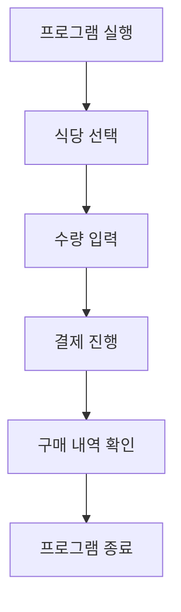

# JavaProgramingFinalterm
# CJU Meal Tickets Management Program

## 1. 개요

### 1.1. 목적
CJU Meal Tickets Management Program은 대학교 내 식권 구매를 간소화하고, 사용자가 각 식당의 메뉴 및 가격 정보를 쉽게 확인하며 식권 구매를 관리할 수 있도록 돕는 Java 기반 GUI 프로그램입니다.

### 1.2. 대상
이 프로그램은 대학교 식당 이용자를 대상으로 하며, 식권 구매 및 기록 관리의 편리함을 제공하려는 목적을 가지고 있습니다.

---

## 2. 프로그램의 중요성 및 필요성

### 2.1. 중요성
- 대학교 식당을 이용하는 학생과 교직원이 효율적으로 식권을 구매할 수 있습니다
- 구매 기록 관리를 통해 구매 내역을 파악할 수 있는 기능을 제공합니다.

### 2.2. 필요성
- 식권 구매 시 대기 시간을 줄이고, 디지털 방식으로 효율적인 결제를 지원합니다.
- 다양한 식당의 가격 정보를 한 화면에서 확인할 수 있어 사용자 경험을 개선합니다.

---

## 3. 프로그램 수행 절차

### 3.1. 다이어그램

---

### 3.2. 클래스 다이어그램

---

## 4. 느낀점
- 처음으로 미리 디자인을 구상해두고 프로젝트를 진행했는데 디자인 도안을 보고 그대로 만드는 것이라 쉬울 것이라고 생각했던 것과 달리 생각보다 복잡한 코드가 되었습니다. 생각보다 어려운 프로젝트가 되었지만 한발짝씩 디자인 도안에 가까워지는 것을 보고 뿌듯함과 흥미를 느꼈습니다. 
- 디자인 도안

- **개선 가능성**:
    - 데이터를 로컬 저장소나 서버에 저장하여 구매 기록을 영구적으로 관리하는 기능 추가의 필요성을 느꼈습니다.
    - 다양한 사용자 요구를 충족하기 위해 메뉴와 가격 정보를 동적으로 불러오는 기능 구현도 검토할 계획입니다.

